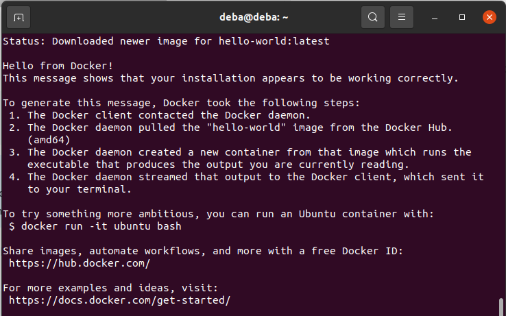

# INSTALLATION GUIDE FOR openPIP

The Open-source Protein Interaction Platform (openPIP) is a customizable web portal designed to host experimental PPI maps. Such a portal is often required to accompany a paper describing the experimental data set, in addition to depositing the data in a standard repository. No coding skills are required to set up and customize the database and web portal. OpenPIP has been used to build the databases and web portals of two major protein interactome maps, the Human and Yeast Reference Protein Interactome maps (HuRI and YeRI, respectively). OpenPIP is freely available as a ready-to-use Docker container for hosting and sharing PPI data with the scientific community.


# INSTALLATION STEPS

**PREREQUISITES**
- **Docker Engine**
	**Setup the Repository**
	 1. Update the  `apt`  package index and install packages to allow  `apt`  to use a repository over HTTPS:
		
			 $ sudo apt-get update
			 $ sudo apt-get install \
			   ca-certificates \
			   curl \
			   gnupg \
			   lsb-release

	 2.  Add Docker’s official GPG key:
		 	```
	         $ curl -fsSL https://download.docker.com/linux/ubuntu/gpg | sudo gpg --dearmor -o /usr/share/keyrings/docker-archive-keyring.gpg
	    
	 3.  Use the following command to set up the **stable** repository.
		 

			  $ echo \ 
			    "deb [arch=$(dpkg --print-architecture) signed-by=/usr/share/keyrings/docker-archive-keyring.gpg] https://download.docker.com/linux/ubuntu \ $(lsb_release -cs) stable" | sudo tee /etc/apt/sources.list.d/docker.list > /dev/null
	**Install Docker Engine**
	 1. Update the  `apt`  package index and install latest version of Docker Engine and containerd:
		
			 $ sudo apt-get update
			 $ sudo apt-get install docker-ce docker-ce-cli containerd.io
		To Install specific version follow this [link](https://docs.docker.com/engine/install/ubuntu/).
	 2.  Verify that Docker Engine is installed correctly by running the `hello-world` image.
		 	```
	         $ sudo docker run hello-world
			``` 
			This command downloads a test image and runs it in a container. When the container runs, it prints a message and exits as shown in the following image.
			
			

    
